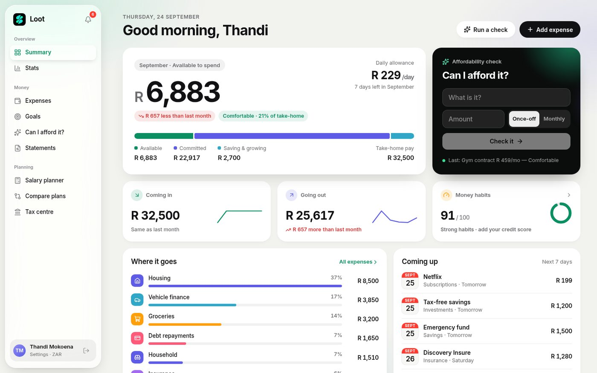
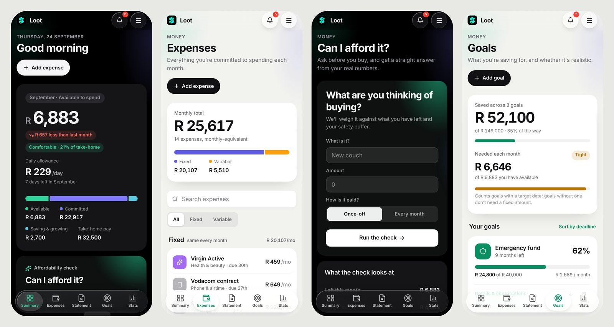
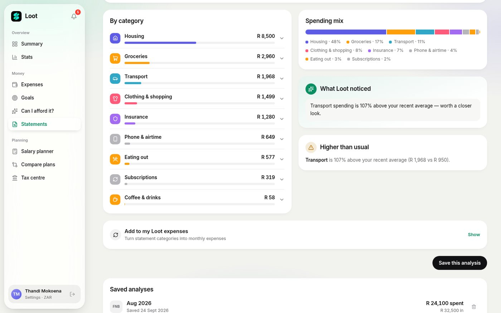
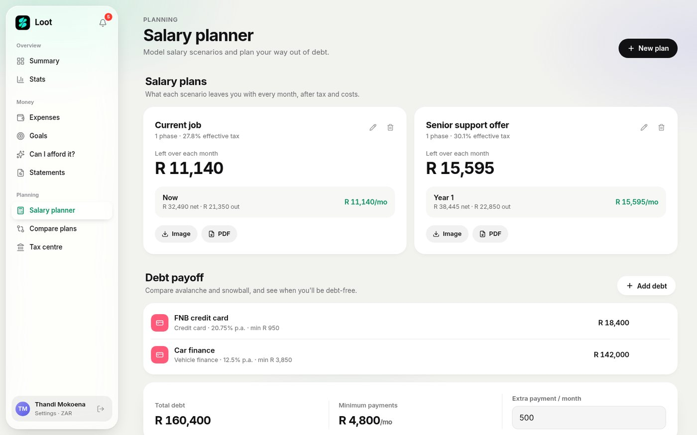
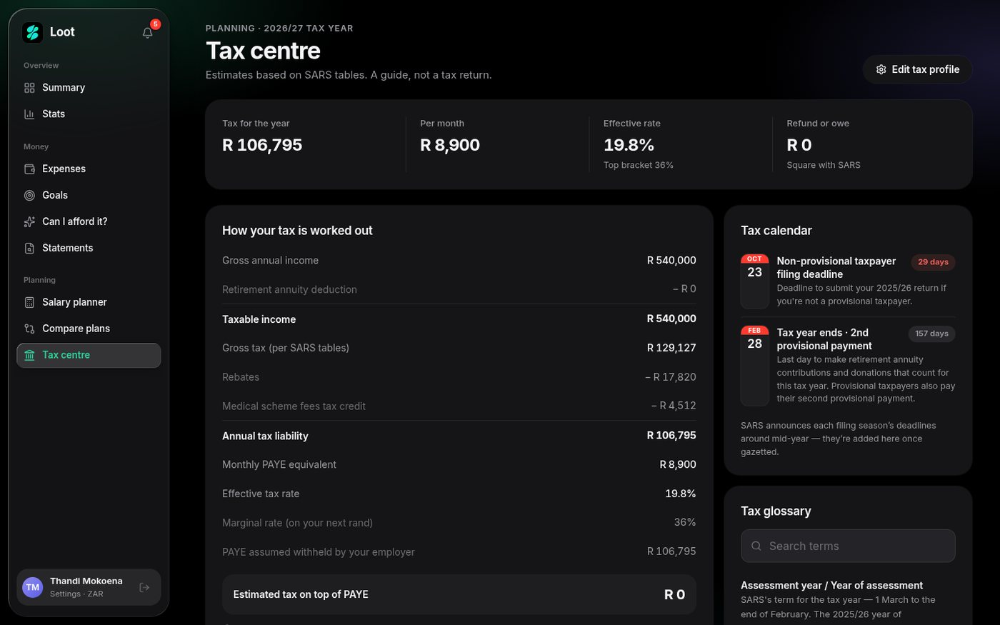
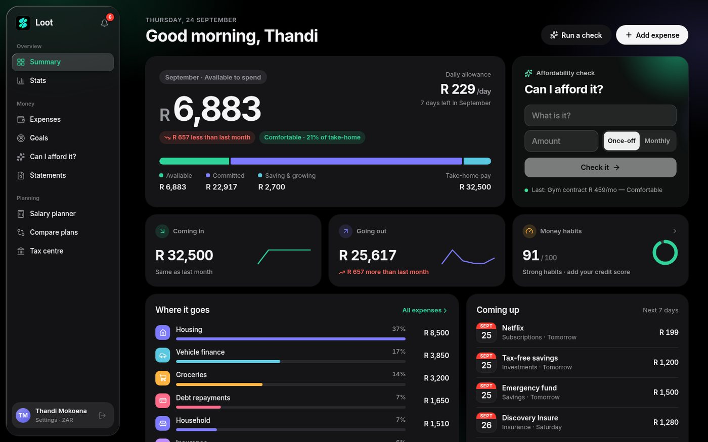
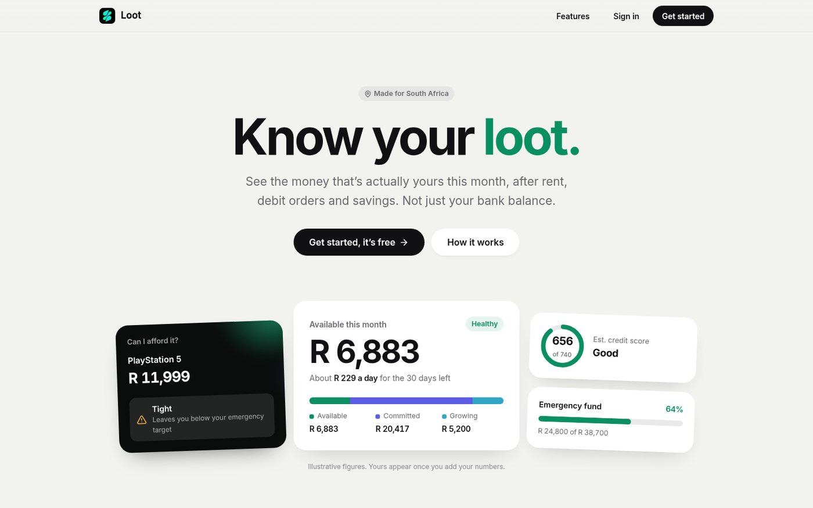

# Loot

**Know your loot.**
A personal finance app for South Africans that shows you the money that's actually yours this month, not just your bank balance.

---

## Why Loot?

Your bank balance isn't the money you have to spend. Part of it is already spoken for: rent, the car payment, debit orders, subscriptions, the medical aid that goes off on the 1st.

Loot takes all of that out first. The number you see on your Summary is what's **genuinely left for the rest of the month**, and it's the number every other feature in the app is built around.

## Who it's for

- **South Africans who get paid monthly, fortnightly or weekly** and want a clear picture of their month.
- **Anyone who's asked "can I afford this?"** at the till or before signing a contract.
- **People paying off debt or saving towards something** (an emergency fund, a trip, a car) who want to know what's realistic.
- **Salaried employees who find tax confusing.** Loot uses SARS tax tables and explains the result in plain language.
- **Couples** who want to see their combined picture without giving up their own view.

No bank login is needed. You stay in control of what goes in.

---

## What it does

### Your real number

The **Summary** shows what's left this month after every commitment. It also shows a daily allowance for the days remaining, and how your take-home pay splits between what's committed, what's saving and growing, and what's free to spend.

### Can I afford it?

Type in what you want to buy, whether it's a once-off or a monthly cost. Loot checks it against what's left, your savings and your safety buffer, then gives you a straight answer: **Comfortable**, **Tight** or **Not now**, with the reason.

### Expenses

Every recurring cost in one place: fixed and variable, weekly, monthly or yearly, all converted to a fair monthly figure. You can get reminders before debit orders go off, and removed items can be undone.

### Goals

Set savings targets with or without a deadline. Loot tells you what to put away each month, warns you when your goals ask for more than you can spare, and can share your spare money between goals automatically.

### Statements

Drop in an **FNB or Capitec** statement (PDF, CSV or OFX) and see where your money went, sorted into categories. It also spots subscriptions and unusual spending. **Your statement is read on your own device and never uploaded.**

### Salary planner and debt payoff

- **Salary planner:** compare a job offer, a raise or a move over several phases, and see what each one leaves you each month after tax.
- **Debt payoff:** add your debts and compare the **avalanche** and **snowball** strategies to see when you'll be debt-free and how much interest you'll pay.
- **Compare plans:** put plans side by side.
- **Export:** download any plan as an image or PDF.

### Tax centre

- **Estimate:** your tax for the year, per month, your effective rate and a likely refund or amount still owed, using current **SARS tax tables**.
- **Deductions:** a tracker for retirement annuities, medical aid, donations and more, showing what each one saves you.
- **Dates and help:** your filing deadlines, a step-by-step eFiling guide and a plain-English glossary.

### Stats and net worth

Month-by-month trends of what comes in, goes out and is left over, plus spending by category over time. It also tracks your net worth (everything you own minus everything you owe) and shows how your spending compares with others on a similar income.

### Loot Score

A rating of your money habits: debt-to-income, savings rate, spending consistency and more, with tips on what to improve. Add your real credit score from ClearScore, TransUnion or your bank app, and Loot tracks an **estimated credit score on your bureau's own scale** as your habits change.

### Household mode

Link up with a partner to see your combined income and expenses, with each expense labelled by whose it is. You each keep your own individual view.

### And the small things

- **Monthly close:** lock in each month and keep a record you can export.
- **Monthly briefing:** a short summary of what changed and one thing to focus on.
- **Month-end forecast:** see where you're heading before the month ends.
- **Notifications:** upcoming debit orders, tax deadlines and goal milestones.
- **Light and dark mode:** follows your device, or pick one.
- **Guided tour:** walks you through every page the first time.

---

## Designed to feel at home on your phone

Loot takes its lead from Apple's design principles: one clear number per page, plain language instead of jargon, and nothing on screen that doesn't earn its place. On mobile, a floating "liquid glass" tab bar keeps every page one tap away. It works in any modern browser and can be added to your home screen like an app.

<table>
  <tr>
    <td></td>
    <td></td>
  </tr>
</table>

---

## Privacy

- **Bank statements are processed entirely in your browser.** Raw transactions never reach Loot's servers; only the category totals you choose to save are stored.
- **No bank login.** Loot never connects to your bank accounts and can't move money.
- **Your data is yours.** Every table is protected so only you can see your records (a linked household partner can see only the shared figures). You can export all your data or delete your account at any time from Settings.

---

## Good to know

- Loot gives **estimates and guidance, not financial, tax or credit advice**. Tax figures follow published SARS tables but aren't a tax return, and the Loot Score is an estimate, not a bureau score.
- Statement import currently supports **FNB and Capitec**, plus most CSV and OFX exports.
- Loot works in Rand by default and supports other currencies for people who think in them.

---

## Built with

React 19 · TypeScript · Vite · TanStack Router & Query · Tailwind CSS v4 · Motion · Recharts · Supabase (Postgres, Auth, Row Level Security, Edge Functions) · deployed on Vercel. Native iOS and Android builds are set up with Capacitor.

---

Made in South Africa · Know your number before you spend it.

